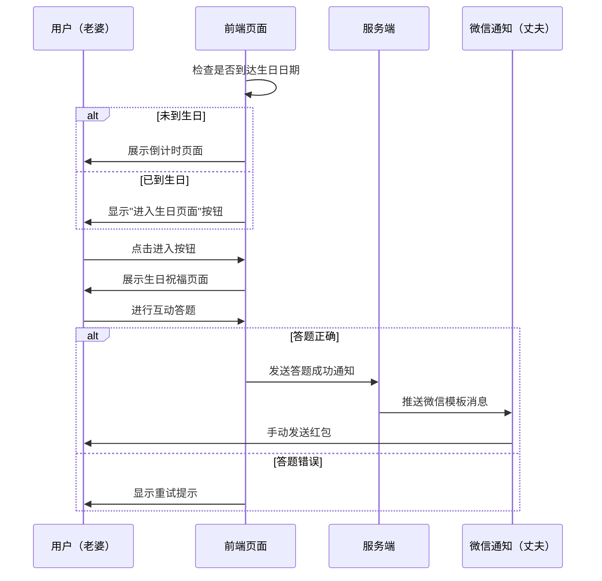
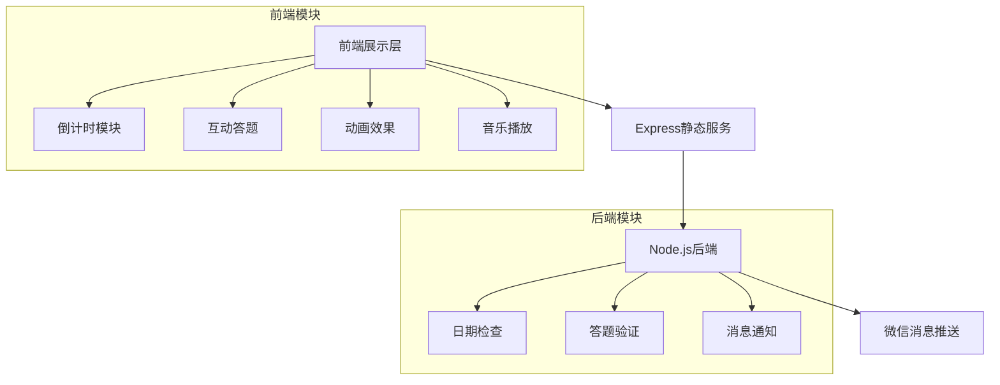
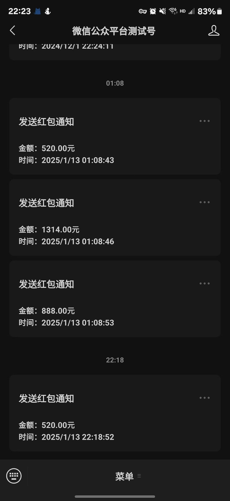

# 当AI遇上爱情：用Cursor开发一个浪漫的生日惊喜项目 🎂

> 如果说程序员的浪漫是写一个完美的递归，那么我要说的是：不！真正的浪漫是用代码来表达爱意！让我们一起来看看如何用技术创造一个特别的生日惊喜吧~ 😘

## 先看效果
<p style="color:red">请使用移动端的方式打开</p>

[点击链接查看效果](https://demo.520ai.xin/birthday/)

### 开发前必备
> 在开始编写浪漫代码之前，先来准备一些必要的"装备"~ 🎯

1. 一个微信公众号测试号 —— 没有的可以参考[文档](https://juejin.cn/post/6844903946260054029?searchId=20250114000249A4FE6749C3AD734B9C7C)
   > 就像追求对象要先有微信一样，这是必需品！😉
2. 一个域名（需要备案）—— 这是你的专属"表白空间"
3. 一个服务器 —— 选择你喜欢的"云"（阿里云、腾讯云、华为云）


## 一、项目缘起 💝

### 1.1 需求背景
作为一名程序员，在老婆生日快到的时候，我遇到了一个巨大的难题：
- 🤔 送什么礼物好呢？
- 😅 如何能让礼物既有心意又能展现专业性呢？
- 🎯 如何能让这个礼物既浪漫又有趣呢？

于是，一个想法在我脑海中浮现：何不用代码来创造一个独一无二的生日惊喜呢？

### 1.2 技术选型
既然要开发，那就要用最新最酷的工具，这次我选择了：
- 🔧 Cursor：AI驱动的新一代IDE （该项目的代码99.99%都是Cursor写的😂）
- 🎨 前端：jQuery + Lottie动画
- 🚀 后端：Node.js + Express
- 📱 响应式：rem布局

> 有人说："PHP是世界上最好的语言"，但在这个项目里，我选择用Node.js，因为它比我对象... 哦不，是因为它的生态更适合这个项目 😏

## 二、开发利器：Cursor初体验 🛠️

### 2.1 为什么选择Cursor？

想象一下，你有一个24小时在线的资深开发搭档，而且：
- 🤖 它懂AI，能秒懂你的需求
- 📝 它会写代码，还写得贼快
- 🔍 它会代码审查，比你前任的查岗还细致
- 🐛 它会找Bug，比你找对象还准确

### 2.2 Cursor的实战体验
```javascript
// 当我写下这样的注释时
// TODO: 需要一个浪漫的动画效果

// Cursor立刻给出了建议：
    // 使用dotlottie-player播放动画文件，balloon.lottie；lottie文件占用空间最小
   // 创建气球动画元素
const balloonAnimation = $(`
    <div class="balloon-animation">
        <dotlottie-player
            src="${CONFIG.ANIMATIONS.balloon}"
            background="transparent"
            speed="1"
            autoplay
        ></dotlottie-player>
    </div>
`);

```

## 三、项目架构：麻雀虽小，五脏俱全 🏗️

### 3.1 业务流程


### 3.2 系统架构


### 3.3 目录结构
```bash
project/
├── client/
│   ├── birthday-surprise/
│   │   ├── css/
│   │   │   ├── common.css    # 通用样式
│   │   │   └── reset.css     # 样式重置
│   │   ├── js/
│   │   │   ├── config.js     # 配置文件（生日日期等）
│   │   │   ├── countdown.js  # 倒计时逻辑
│   │   │   ├── quiz.js      # 答题逻辑
│   │   │   └── animation.js  # 动画控制
│   │   └── index.html        # 主页面
└── server/
    ├── config/
    │   ├── wechat.js         # 微信配置
    │   └── database.js       # 数据库配置
    ├── utils/
    │   └── wechatService.js  # 微信服务
    └── server.js             # 服务入口

```

### 3.4 关键配置说明
```javascript
// client/birthday-surprise/js/config.js
const CONFIG = {
  // 生日日期配置
  BIRTHDAY: {
    date: "2024-11-23 00:00:00", // 生日日期
    format: "YYYY-MM-DD HH:mm:ss", // 日期格式
  },

  // 页面配置
  PAGES: ["welcome", "card", "gallery", "game", "gift"],

  // 动画配置
  ANIMATIONS: {
    welcome: "assets/lottie/welcome.lottie",
    loading: "assets/lottie/loading.lottie",
    red_envelope: "assets/lottie/red_envelope.lottie",
    wrong: "assets/lottie/wrong.lottie",
    complete: "assets/lottie/complete.lottie",
    balloon: "assets/lottie/balloon.lottie",
    kiss: "assets/lottie/kiss.lottie",
  },

  // 欢迎页文字配置
  WELCOME_TEXT: {
    title: "亲爱的老婆",
    subtitle: ["今天是你的生日", "让我们一起开启这段浪漫旅程"],
  },

  // 游戏配置
  GAME_QUESTIONS: [
    {
      question: "我们第一次见面是在哪里？",
      options: ["咖啡厅", "公园", "图书馆", "电影院"],
      correctIndex: 0,
      feedback: "没错！那天的咖啡香依然记忆犹新～",
      reward: "520",
    },
    {
      question: "我最喜欢的颜色是什么？",
      options: ["蓝色", "粉色", "紫色", "红色"],
      correctIndex: 2,
      feedback: "就知道你记得！这就是我们心有灵犀～",
      reward: "1314",
    },
    {
      question: "我们的第一次约会去了哪里？",
      options: ["游乐园", "海边", "动物园", "植物园"],
      correctIndex: 1,
      feedback: "对啦！那天的夕阳真的很美，就像你一样～",
      reward: "888",
    },
  ],

  // 卡片文字配置
  CARD_TEXT: [
    "亲爱的老婆",
    "生日快乐！",
    "这是我们在一起后的第12个生日",
    "也是我们认识的第4191天",
    "感谢你一直以来的陪伴和支持",
    "愿你永远快乐、永远美丽",
    "我爱你！",
  ],

  // 图片配置
  GALLERY_IMAGES: [
    {
      url: "assets/images/1.jpg",
      title: "我们的第一张合照",
    },
    {
      url: "assets/images/2.jpg",
      title: "一起看的第一场电影",
    },
    {
      url: "assets/images/3.jpg",
      title: "第一次旅行",
    },
    {
      url: "assets/images/4.jpg",
      title: "最难忘的生日",
    },
    {
      url: "assets/images/5.jpg",
      title: "最浪漫的时刻",
    },
  ],
  // 最后的感谢
  THANK_TEXT: [
    "亲爱的老婆：",
    "感谢你完成了所有的小测验",
    "这些都是我们一起创造的珍贵回忆",
    "每一个瞬间都让我感恩有你在身边",
    "谢谢你选择了我",
    "让我的生活充满色彩",
    "未来的日子，我会更加珍惜",
    "生日快乐，我最爱的人",
  ],
};


// server/config/wechat.js
module.exports = {
    appId: 'xxx',      // 微信公众号配置
    appSecret: 'xxx',  // 用于消息推送
    templateId: 'xxx'  // 消息模板ID
};
```

## 四、核心功能实现 ⚙️

### 4.1 响应式布局
```css
/* 这个rem配置比我和前任的适配还要完美 */
html {
    font-size: calc(100vw / 375 * 10);
}
```

### 4.2 动画效果
使用Lottie实现的动画效果，比你前任的套路还要丝滑：
```javascript
// 这个动画比你前任的套路还要丝滑
const balloonAnimation = $(`
    <div class="balloon-animation">
        <dotlottie-player
            src="${CONFIG.ANIMATIONS.balloon}"
            background="transparent"
            speed="1"
            autoplay
        ></dotlottie-player>
    </div>
`);
```

### 4.3 微信通知
```javascript
// 当ta答对问题时，你会收到这样的消息：
// 快掏出红包，这可是比bug修复还要紧急的任务！
async sendRedPacketNotification(price) {
    try {
        const accessToken = await this.getAccessToken();
        const response = await axios.post(
            `https://api.weixin.qq.com/cgi-bin/message/template/send?access_token=${accessToken}`,
            {
                touser: config.testOpenId,
                template_id: config.sendRedPacketTemplateId,
                data: {
                    price: {
                        value: `请打赏你家宝贝${price.toFixed(2)}元`,
                        color: "#FF0000"
                    },
                    sendTime: {
                        value: new Date().toLocaleString(),
                        color: "#173177"
                    }
                }
            }
        );

        if (response.data.errcode === 0) {
            console.log('红包通知发送成功');
            return true;
        }
        throw new Error(`发送失败: ${response.data.errmsg}`);
    } catch (error) {
        console.error('发送红包通知失败:', error);
        throw error;
    }
}
```


## 五、开发过程中的"坑"与"爬坑" 🕳️

### 5.1 那些年我们踩过的坑
1. 动画性能问题
   > 就像感情一样，动画也要细水长流，不能太贪心 😌
2. 移动端适配
   > 设备适配比适配对象的脾气还难搞 😅
3. 资源加载优化
   > 加载速度要快，就像你第一次见到她就心动一样 ❤️

### 5.2 解决方案
- 使用RAF优化动画
- 采用rem布局
- 实现资源预加载

## 六、项目成果 🎉

### 6.1 最终效果
- ✨ 流畅的页面动画
- 🎮 有趣的互动游戏
- 🎵 浪漫的背景音乐
- 📱 完美的移动适配
- 💌 及时的消息推送

### 6.2 老婆的反馈
> "这可能是你写过的最浪漫的代码了！" 
>
> （终于不用再说"你的代码有bug"了 😂）

## 七、技术总结与反思 🤔

### 7.1 技术亮点
- Cursor + AI 辅助开发
- 响应式设计
- 性能优化
- 微信集成

### 7.2 可优化空间
- SSR支持
- 更多互动游戏
- 性能进一步优化

## 八、写在最后 ✍️

正如代码需要不断迭代优化一样，爱情也需要持续的经营和维护。
希望这个项目不仅仅是一个生日礼物，更是一份永久保存的爱的见证。

> 如果你也想为另一半开发一个特别的礼物，不妨试试这个方案。
>
> 记住：代码写得好，老婆笑得早！😉
>
> 记住：编程再难，也没有哄老婆难！🌹
>
> 最后的最后：这个项目的代码可能会有bug，但是对老婆的爱永远没有bug！❤️

---
- 项目源码：[GitHub地址](https://github.com/yuanyang749/demo-node-service)
- 演示地址：[Demo链接](https://demo.520ai.xin/birthday/)
- 开发工具：[Cursor](https://cursor.com/) —— 你的AI编程助手，不会写代码也能做出浪漫的礼物！

> 特别感谢：感谢Cursor的AI，帮我写出了99.99%的代码。
>
> 剩下的0.01%？那是我在代码里注入的爱意！💝
