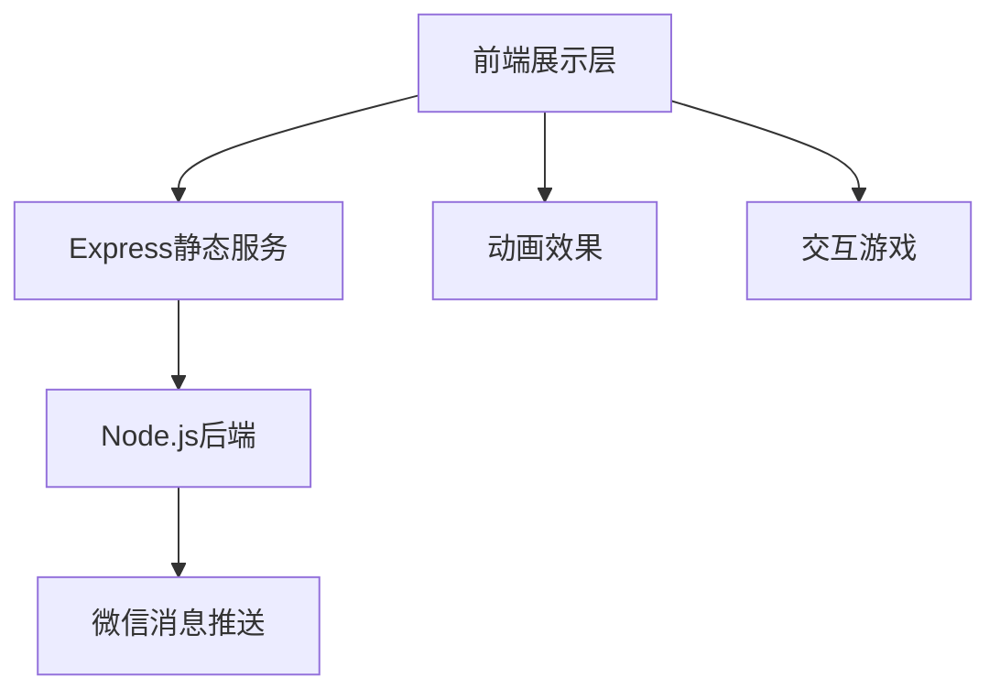

# 当AI遇上爱情：用Cursor开发一个浪漫的生日惊喜项目 🎂

> 如果说程序员的浪漫是写一个完美的递归，那么我要说的是：不！真正的浪漫是用代码来表达爱意！让我们一起来看看如何用技术创造一个特别的生日惊喜吧~ 😘

## 一、项目缘起 💝

### 1.1 需求背景
作为一名程序员，在老婆生日快到的时候，我遇到了一个巨大的难题：
- 🤔 送什么礼物好呢？
- 😅 如何能让礼物既有心意又能展现专业性呢？
- 🎯 如何能让这个礼物既浪漫又有趣呢？

于是，一个想法在我脑海中浮现：何不用代码来创造一个独一无二的生日惊喜呢？

### 1.2 技术选型
既然要开发，那就要用最新最酷的工具，这次我选择了：
- 🔧 Cursor：AI驱动的新一代IDE
- 🎨 前端：jQuery + Lottie动画
- 🚀 后端：Node.js + Express
- 📱 响应式：rem布局

> 有人说："PHP是世界上最好的语言"，但在这个项目里，我选择用Node.js，因为它比我对象... 哦不，是因为它的生态更适合这个项目 😏

## 二、开发利器：Cursor初体验 🛠️

### 2.1 为什么选择Cursor？


想象一下，你有一个24小时在线的资深开发搭档，而且：
- 🤖 它懂AI，能秒懂你的需求
- 📝 它会写代码，还写得贼快
- 🔍 它会代码审查，比你前任的查岗还细致
- 🐛 它会找Bug，比你找对象还准确

### 2.2 Cursor的实战体验
```javascript
// 当我写下这样的注释时
// TODO: 需要一个浪漫的动画效果

// Cursor立刻给出了建议：
const lottieAnimation = {
    container: document.getElementById('animation'),
    renderer: 'svg',
    loop: true,
    autoplay: true,
    path: 'animations/romantic_heart.json'
};
```

## 三、项目架构：麻雀虽小，五脏俱全 🏗️

### 3.1 整体架构


### 3.2 目录结构
```bash
project/
├── client/
│   ├── birthday-surprise/
│   │   ├── css/
│   │   ├── js/
│   │   └── index.html
└── server/
    ├── config/
    ├── utils/
    └── server.js
```

## 四、核心功能实现 ⚙️

### 4.1 响应式布局
```css
/* 这个rem配置比我和前任的适配还要完美 */
html {
    font-size: calc(100vw / 375 * 10);
}
```

### 4.2 动画效果
使用Lottie实现的动画效果，比你前任的套路还要丝滑：
```javascript
const heartAnimation = bodymovin.loadAnimation({
    // 动画配置
});
```

### 4.3 微信通知
```javascript
// 当你的代码成功运行时，她的手机会收到这样的消息：
async function sendLoveMessage() {
    await wechatService.sendTemplateMessage({
        title: "来自老公的爱意❤️",
        content: "这不是Bug，这是特性！"
    });
}
```

## 五、开发过程中的"坑"与"爬坑" 🕳️

### 5.1 那些年我们踩过的坑
1. 动画性能问题
   > 就像感情一样，动画也要细水长流，不能太贪心 😌
2. 移动端适配
   > 设备适配比适配对象的脾气还难搞 😅
3. 资源加载优化
   > 加载速度要快，就像你第一次见到她就心动一样 ❤️

### 5.2 解决方案
- 使用RAF优化动画
- 采用rem布局
- 实现资源预加载

## 六、项目成果 🎉

### 6.1 最终效果
- ✨ 流畅的页面动画
- 🎮 有趣的互动游戏
- 🎵 浪漫的背景音乐
- 📱 完美的移动适配
- 💌 及时的消息推送

### 6.2 老婆的反馈
> "这可能是你写过的最浪漫的代码了！" 
> （终于不用再说"你的代码有bug"了 😂）

## 七、技术总结与反思 🤔

### 7.1 技术亮点
- Cursor + AI 辅助开发
- 响应式设计
- 性能优化
- 微信集成

### 7.2 可优化空间
- SSR支持
- 更多互动游戏
- 性能进一步优化

## 八、写在最后 ✍️

正如代码需要不断迭代优化一样，爱情也需要持续的经营和维护。
希望这个项目不仅仅是一个生日礼物，更是一份永久保存的爱的见证。

> 如果你也想为另一半开发一个特别的礼物，不妨试试这个方案。
> 记住：代码写得好，老婆笑得早！😉

---
项目源码：[GitHub地址](https://github.com/yuanyang749/demo-node-service)
演示地址：[Demo链接](https://demo.520ai.xin/birthday/)
